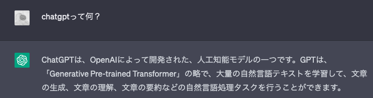

<!--
headingDivider: 2
_class: title
_paginate: false
_header: ""
-->
#  【親展】ようこそ、ネットワーク・AIのブラックボックスの中へ 
&emsp;&emsp;AI編

## 自己紹介

甲本健太

- 所属：名古屋大学情報学部自然情報学科 数理情報系 3年
- 出身：秋田県 :japanese_ogre:
- 好きな食べ物：うなぎ
- 機械学習ゼミ：
  「ゼロから作るディープラーニング」という本をみんなで勉強

---
### 最近"AI"ってよく聞きませんか？？

- StableDiffusion（画像生成AI）

- ChatGPT（チャットボットAI）

## 機械学習って何？

## 一言で言うと？

- データから自動的に**パターン**を発見し、未知のデータに対する予測や分類を行う人工知能の技術
- [StableDiffusion](https://github.com/Stability-AI/stablediffusion)とか[ChatGPT](https://openai.com/blog/chatgpt)も基本的にはこれ

<!-- ---
 -->

<!--
--
_paginate: false
_header: ""
_footer: ""
-->

## ここでクイズ！

### 第1問

