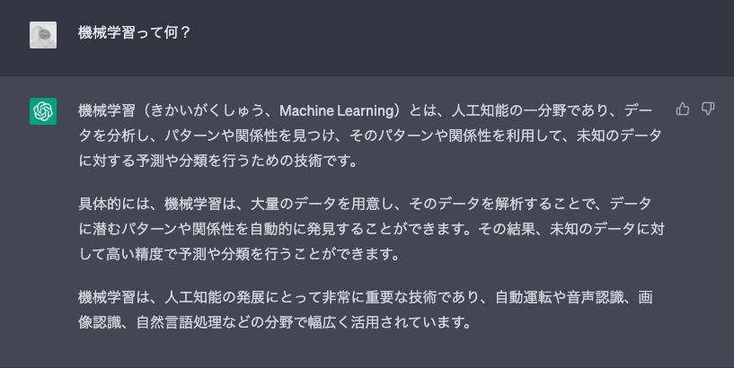
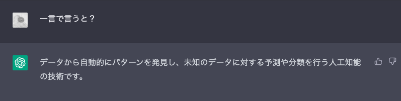
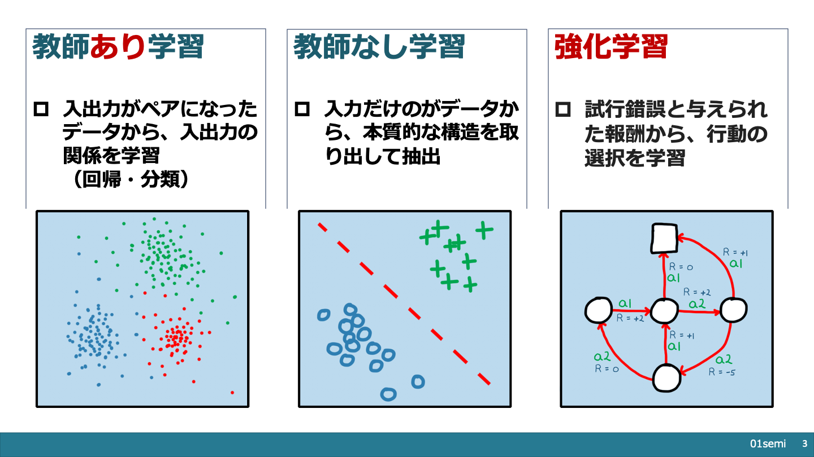

<!--
headingDivider: 2
_class: title
_paginate: false
_header: ""
-->
#  【親展】ようこそ、ネットワーク・AIのブラックボックスの中へ 
&emsp;&emsp;AI編

## 機械学習って何？

## 一言で言うと？

- データから自動的に**パターン**を発見し、未知のデータに対する予測や分類を行う人工知能の技術

---

<!--
_paginate: false
_header: ""
_footer: ""
-->

